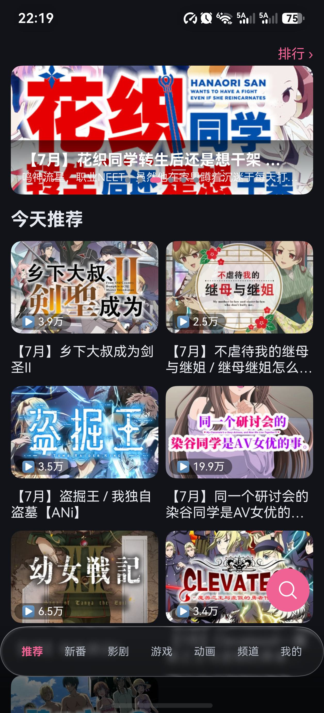
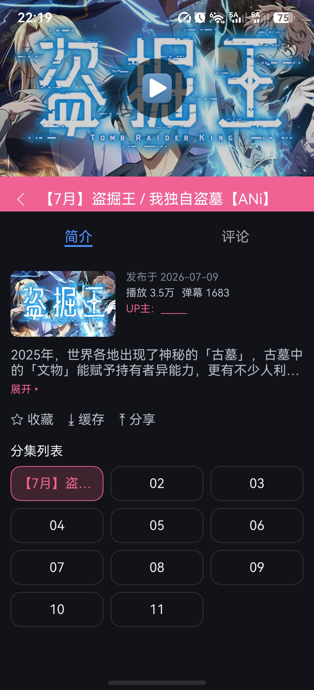
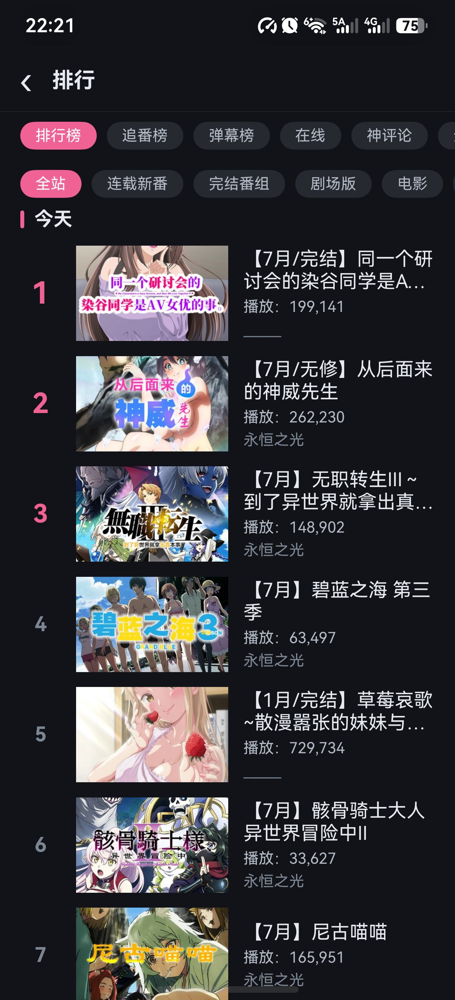
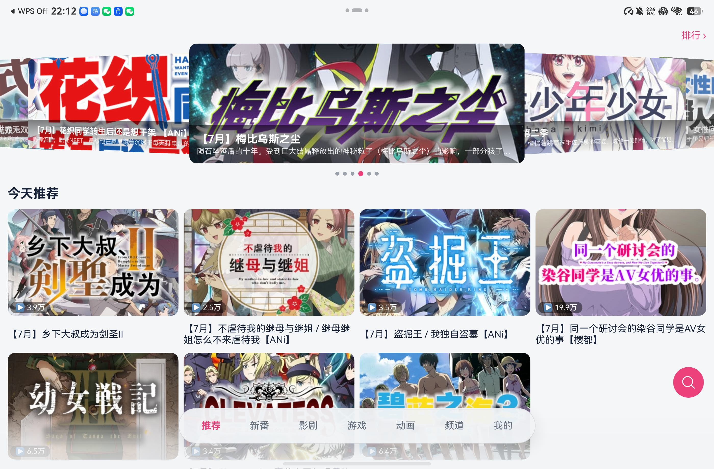
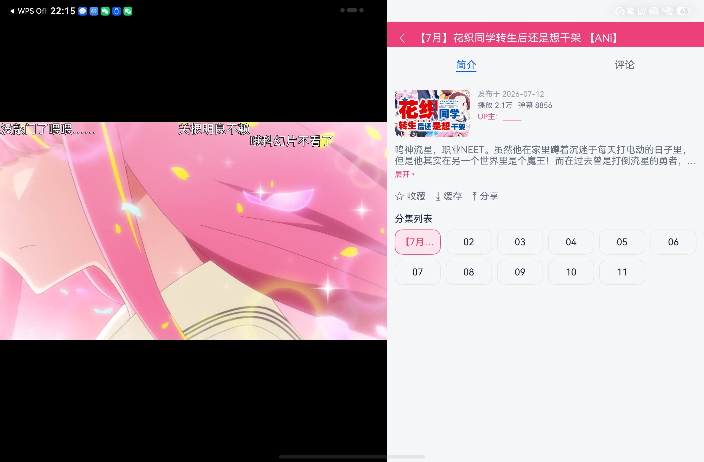

# TucaoHarmony

吐槽视频网（[tucao.my](https://www.tucao.my)）第三方 HarmonyOS 客户端。

## 功能特性

- **视频播放**：多段源播放、断点续播、倍速、后台播放、全屏沉浸、锁屏/播控中心控制
- **弹幕**：弹幕渲染、字号/透明度/显示区域设置、离线弹幕、弹幕发送
- **互动**：评论、楼中楼、私信、收藏、播放历史
- **离线缓存**：视频下载（断点续传）、离线全屏播放、弹幕文件缓存
- **投屏**：DLNA 投屏与远端控制
- **多设备**：手机 / 平板 / 2in1 自适应布局、应用接续、碰一碰分享
- **首页频道**：推荐、新番、影剧、游戏、动画、频道宫格，搜索与排行榜

## 界面预览

### 手机

<p align="center">
  
  
  
  
</p>

### 平板

<p align="center">
  
  
  
</p>

## 构建

1. 安装 [DevEco Studio](https://developer.huawei.com/consumer/cn/deveco-studio/)（API 26 及以上）。
2. 同步依赖：

   ```bash
   ohpm install
   ```

3. **应用弹幕库补丁（必做）**：本仓库对三方库 `@ohos/danmakuflamemaster` 有本地修复（seek 后弹幕不渲染等问题），依赖安装 / 同步后需重新应用补丁：

   ```bash
   bash scripts/apply-danmakuflamemaster-fix.sh
   ```

4. 在 DevEco Studio 中配置签名（File → Project Structure → Signing Configs，勾选 Automatically generate signature）。
5. 连接设备，Build → Build Hap(s) / Run。

## 开源

- 作者：[dvc890](https://github.com/dvc890)
- 仓库：https://github.com/dvc890/TucaoHarmony
- 协议：[MIT License](LICENSE)

## 致谢

- [tucao.my](https://www.tucao.my) —— 内容来源
- [DanmakuFlameMaster](https://github.com/bilibili/DanmakuFlameMaster) —— 弹幕引擎设计参考
- [ImageKnife](https://gitee.com/openharmony-tpc/ImageKnife) —— 图片加载缓存
- [RxDownload](https://github.com/ssseasonnn/RxDownload) —— 断点续传设计参考

## 声明

本项目仅供学习交流使用。内容与接口均来自 tucao.my，本客户端不存储任何视频内容。请于 24 小时内删除并支持正版。
